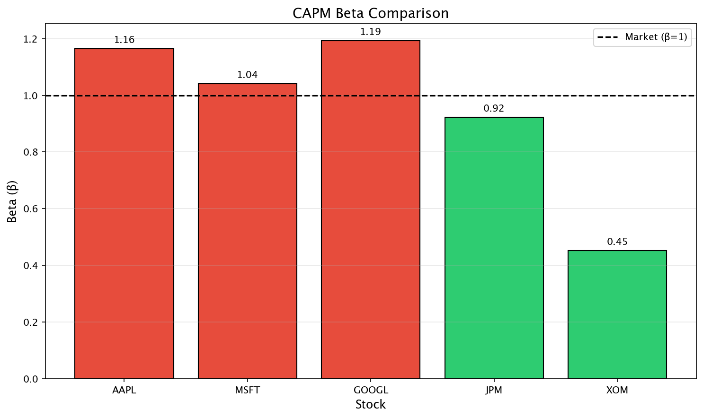
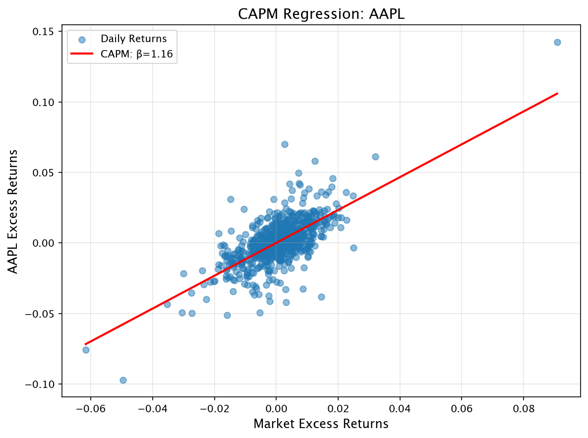

# Factor Modeling: CAPM Analysis

[](https://www.python.org/downloads/)
[](#-testing)
[](https://peps.python.org/pep-0008/)
[](LICENSE)

A Python-based quantitative finance project implementing the **Capital Asset Pricing Model (CAPM)** to analyze stock returns and estimate systematic risk (beta) for equities.



## 📊 Overview

This project performs single-factor regression analysis using the CAPM framework:

$$R_i - R_f = \alpha_i + \beta_i (R_m - R_f) + \epsilon_i$$

Where:
- $R_i$ = Stock return
- $R_f$ = Risk-free rate
- $R_m$ = Market return (S&P 500)
- $\alpha$ = Jensen's Alpha (abnormal return)
- $\beta$ = Systematic risk (market sensitivity)

## 🏗️ Project Structure

```
Factor Modeling/
├── README.md
├── requirements.txt
├── .gitignore
├── factor_model/               # Source code
│   ├── __init__.py
│   ├── data_collector.py      # Downloads and processes market data
│   └── regression.py          # CAPM regression analysis
├── data/                       # Data files
│   ├── merged_excess_returns.csv
│   └── capm_results.csv
├── notebooks/                  # Jupyter notebooks
│   └── capm_analysis.ipynb
├── plots/                      # Generated visualizations
│   ├── beta_comparison.png
│   ├── capm_aapl.png
│   └── ...
├── scripts/                    # Utility scripts
│   └── show_plots.py
└── tests/                      # Unit tests
    ├── test_data_collector.py
    └── test_regression.py
```

## 🚀 Quick Start

### Installation

```bash
# Clone the repository
git clone https://github.com/yourusername/factor-modeling.git
cd factor-modeling

# Create virtual environment (recommended)
python -m venv venv
source venv/bin/activate  # On Windows: venv\Scripts\activate

# Install dependencies
pip install -r requirements.txt
```

### Run the Analysis

```bash
# Navigate to the project directory
cd "Factor Modeling"

# Step 1: Collect and process data
python -m factor_model.data_collector

# Step 2: Run CAPM regression and generate plots
python -m factor_model.regression --save-plots
```

**Command options:**
| Flag | Description |
|------|-------------|
| (none) | Run regression only, no plots |
| `--save-plots` | Save plots to `plots/` directory |
| `--show` | Display plots interactively (see note below) |

> **Note for interactive plots (`--show`):** For plots to display interactively, run from macOS Terminal.app (not VS Code's integrated terminal). Alternatively, use the Jupyter notebook for inline plots.

**Run full pipeline:**
```bash
python -m factor_model.data_collector && python -m factor_model.regression --save-plots
```

### View Plots

**Option 1:** Open the saved plots in `plots/` directory
```bash
open plots/beta_comparison.png
open plots/capm_aapl.png
```

**Option 2:** Run the interactive plot viewer (in macOS Terminal.app)
```bash
python scripts/show_plots.py
```

**Option 3:** Use the Jupyter Notebook for inline plots
```bash
jupyter notebook notebooks/capm_analysis.ipynb
```

### Interactive Analysis

Launch the Jupyter notebook for interactive exploration with visualizations:
```bash
jupyter notebook capm_analysis.ipynb
```

## 🧪 Testing

Run the test suite with pytest:

```bash
# Run all tests
pytest tests/ -v

# Run with coverage report
pytest tests/ -v --cov=factor_model --cov-report=term-missing

# Run specific test file
pytest tests/test_regression.py -v

# Run specific test class
pytest tests/test_data_collector.py::TestExcessReturns -v
```

**Expected output:**
```
============================= test session starts ==============================
collected 29 items

tests/test_data_collector.py ................                            [ 55%]
tests/test_regression.py .............                                   [100%]

============================= 29 passed =======================================
```

## 📈 Features

### Data Collection (`data_collector.py`)
- Downloads historical stock prices from Yahoo Finance
- Calculates **log returns** for accurate compounding
- Computes **excess returns** over the risk-free rate
- Supports multiple stock tickers simultaneously
- Uses S&P 500 (`^GSPC`) as market proxy

### Regression Analysis (`regression.py`)
- Performs **OLS regression** using statsmodels
- Calculates key metrics:
  - **Alpha**: Risk-adjusted abnormal return
  - **Beta**: Market sensitivity/systematic risk
  - **R-squared**: Model explanatory power
  - **P-values**: Statistical significance
- Generates regression plots
- Exports results to CSV

## 📊 Visualizations

### CAPM Regression Example (AAPL)


### Beta Comparison Across Stocks


## 📋 Sample Output

```
Running CAPM regressions...

------------------------------
Stock: AAPL
Annualized Alpha: 0.0414
Beta: 1.1638
R-squared: 0.4726
Alpha p-value: 0.6997 (Not Significant)
Beta p-value: 0.0000 (Significant)

------------------------------
Stock: MSFT
Annualized Alpha: 0.0412
Beta: 1.0402
R-squared: 0.4575
...

=== SUMMARY TABLE ===
   Stock     Alpha      Beta  R_squared  Alpha_pvalue    Beta_pvalue
0   AAPL  0.000164  1.163815   0.472606      0.699695  3.683556e-106
1   MSFT  0.000163  1.040192   0.457459      0.677308  1.509282e-101
2  GOOGL  0.000774  1.192291   0.351581      0.168547   1.699866e-72
3    JPM  0.000534  0.922465   0.361746      0.208839   4.513688e-75
4    XOM -0.000094  0.451971   0.089994      0.850420   4.404214e-17
```

## 🔧 Configuration

### Default Settings
| Parameter | Value | Description |
|-----------|-------|-------------|
| Stocks | AAPL, MSFT, GOOGL, JPM, XOM | Target equities |
| Market Proxy | ^GSPC (S&P 500) | Benchmark index |
| Date Range | 2023-01-01 to 2026-01-01 | Historical period |
| Risk-Free Rate | 2% annual | Treasury proxy |
| Trading Days | 252 | Annualization factor |

### Customization

Edit `factor_model/data_collector.py` to change stocks or date range:
```python
symbols = ["AAPL", "MSFT", "GOOGL", "JPM", "XOM"]  # Add/remove tickers
start = "2023-01-01"
end = "2026-01-01"
```

## 📖 Interpreting Results

| Metric | Interpretation |
|--------|----------------|
| **Alpha > 0** | Stock outperforms market on risk-adjusted basis |
| **Alpha < 0** | Stock underperforms market on risk-adjusted basis |
| **Beta > 1** | More volatile than market (aggressive) |
| **Beta < 1** | Less volatile than market (defensive) |
| **Beta = 1** | Moves with the market |
| **R² close to 1** | Market explains most of stock's variance |

## 🛠️ Dependencies

| Package | Purpose |
|---------|---------|
| numpy | Numerical computations |
| pandas | Data manipulation |
| yfinance | Yahoo Finance data API |
| statsmodels | Statistical modeling (OLS regression) |
| matplotlib | Visualization |
| seaborn | Enhanced visualizations |
| pytest | Unit testing |

## 📚 API Reference

### Data Collection
```python
from factor_model import (
    get_stock_returns,
    get_market_returns,
    get_risk_free_rate,
    calculate_excess_returns,
    merge_data
)

# Download stock returns
stocks = get_stock_returns(["AAPL", "MSFT"], "2023-01-01", "2024-01-01")

# Download market returns (S&P 500)
market = get_market_returns("2023-01-01", "2024-01-01")

# Calculate excess returns
rf_rate = get_risk_free_rate()
stock_excess = calculate_excess_returns(stocks, rf_rate)
market_excess = calculate_excess_returns(market, rf_rate)

# Merge data
data = merge_data(stock_excess, market_excess)
```

### Regression Analysis
```python
from factor_model import single_factor_regression, run_all_regressions

# Single stock regression
model = single_factor_regression(stock_excess["AAPL"], market_excess["Market"])
print(f"Beta: {model.params.iloc[1]:.4f}")
print(f"R-squared: {model.rsquared:.4f}")

# Run for all stocks
results_df = run_all_regressions(stock_excess, market_excess["Market"])
```

## 🎯 Key Learnings

This project demonstrates:
- **Financial Theory**: CAPM model implementation and interpretation
- **Data Engineering**: Fetching and processing real-world financial data
- **Statistical Analysis**: OLS regression, hypothesis testing, p-values
- **Python Best Practices**: Type hints, docstrings, unit testing, modular design
- **Software Engineering**: Package structure, CLI arguments, error handling

## 📝 Future Enhancements

- [ ] Multi-factor models (Fama-French 3-Factor, 5-Factor)
- [ ] Rolling window beta estimation
- [ ] Portfolio optimization (Mean-Variance)
- [ ] Risk metrics (VaR, CVaR, Sharpe Ratio)
- [ ] Automated PDF reporting
- [ ] Web dashboard with Streamlit

## 👤 Author

**Patience Fuglo**

## 📄 License

This project is licensed under the MIT License - see the [LICENSE](LICENSE) file for details.

---

*Built for quantitative finance analysis and risk assessment.*
